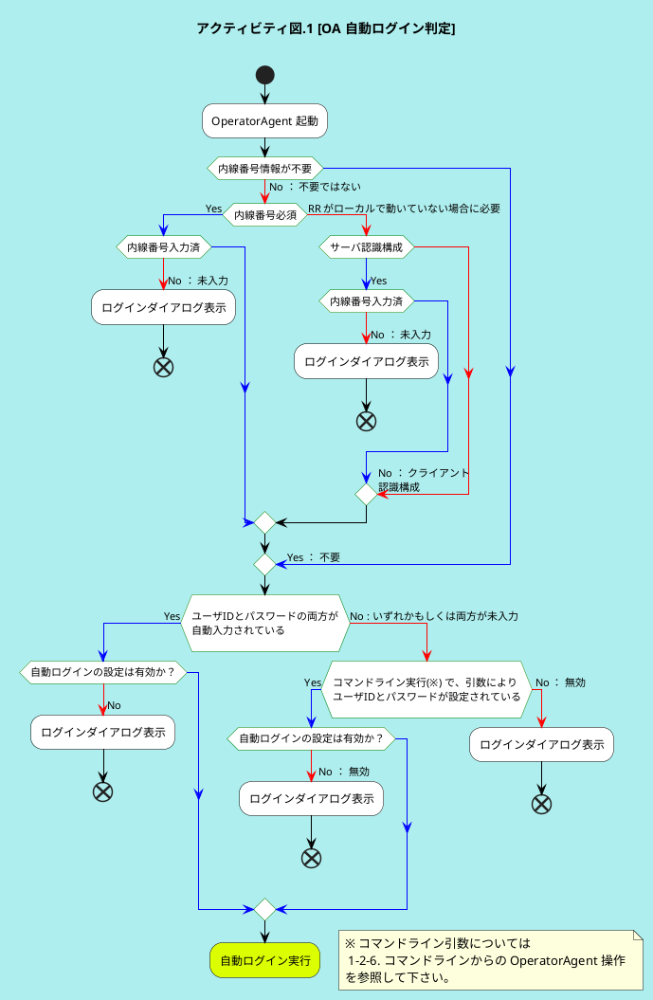
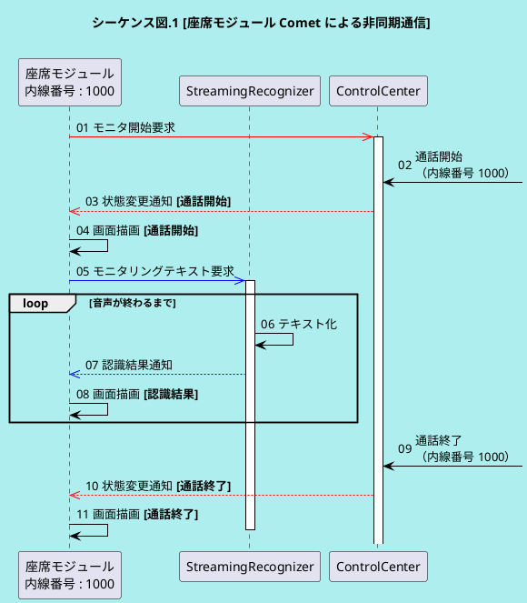

# Markdown 書式のヘルプ


## 1. 見出しの書き方と運用ルール

# h1 ドキュメントタイトル
## h2 チャプター
### h3 セクション
#### h4 パート
##### h5 トピック → 非推奨、下記、リストなどをつかってください。

## 2. リスト

### 2-1. 番号付きリスト

1. リスト
    1. リスト
    1. リスト
1. リスト

### 2-2. 番号なしリスト

- リスト
    - リスト
    - リスト
        - リスト
    - リスト
- リスト

### 2-3. 組み合わせ

1. リスト  
    - リスト  
    - リスト  
1. リスト  


## 3. ヒントタグ


チェックポイント: 情報です。



お役立ち情報: こんなことができます！



警告: 呼損するぜ



working: 作業中、あとで編集するぜ


## 4. 画像の挿入
  
キャプションと画像番号は自動採番

## 5. 表
表のキャプションと番号を採番する方法がない。。

### 5-1. Markdown 書式

| デフォルト | 左寄せ | 右寄せ | センター
|-|:---|---:|:------:|
| ○ | ○ | ○ | ○ |
| × | × | × | × |

セルのアライメントは、コロンの付け方で調整する。  

### 5-2. csv 形式（直接入力）


c1,c2,c3
1,1,1
2,2,2


### 5-3. csv 形式（ファイルインポート）



## 6. 数式

$$ e^{j\theta} = \cos(\theta) + j\sin(\theta) $$  

$$f(x) = sin(x) +12$$

$$f(x) = \frac{a_0}{2} + \sum_{n = 1}^{\infty} a_n \cos nx + b_n \sin nx$$

## 7. UML

### 7-1. アクティビティ図



### 7-2. シーケンス図



## 8. グラフ


    {
        "title":"cos(2*PI*x/2)*(1+0.5cos(2*PI*x/100))",     
        "grid":true,
        "xAxis": {
            "label":"Sample",
            "domain": [0,300]
        },
        "yAxis": {
            "label":"Amplitude",
            "domain": [-1.5,1.5]
        },
        "data": [
            { "fn": "cos(2*PI*x/2)*(1+0.5cos(2*PI*x/100))"},         
            { "fn": "(1+0.5cos(2*PI*x/100))"}
        ]
    }


## 9. コードブロック

```
import math  
print(math.pi)  
```  

```
abcdefg  
ああああああ  
```

## 10. 作業者

1. さかまき@maru9makky
1. しろた@t-shirota
1. ごうど
1. 担当者
1. 担当者
1. 担当者
1. 担当者
